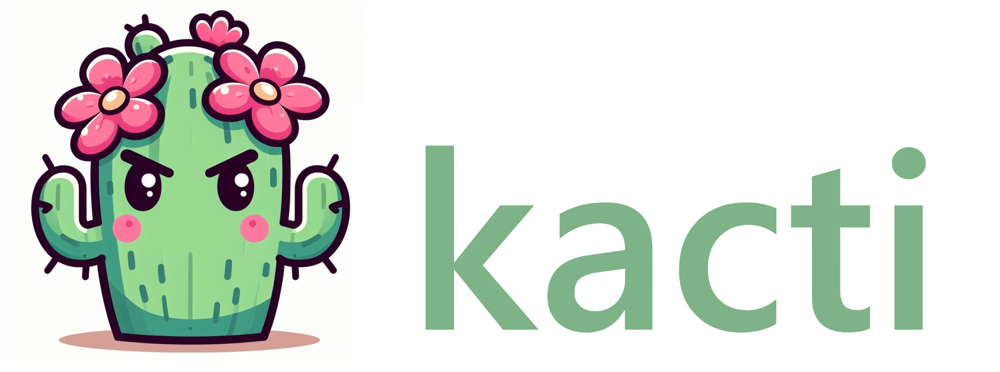

[](https://opensource.org/licenses/Apache-2.0) | [](https://slsa.dev)

# What is kacti?
`kacti` is a command-line tool for verification of Kubernetes admission controllers.

`kacti` is designed to functionally test whether admission control is correctly configured. It attempts to deploy known-bad containers to Kubernetes clusters, and verifies whether the containers successfully deploy.

## Quick start
Grab the latest `kacti` binary:
```
$ curl -Lo kacti https://github.com/shaneboulden/kacti/releases/latest/download/kacti-linux-amd64 && \
      sudo mv kacti-linux-amd64 /usr/local/bin/kacti && \
      chmod 0755 /usr/local/bin/kacti
```
Ensure that you're logged into a Kubernetes cluster and have permissions to create deployments:
```
$ export KUBECONFIG=/path/to/kubeconfig

$ kubectl auth can-i create deploy
yes
```
Create a file holding your tests:
```
cat << EOF > kacti.yaml
---
- name: pwnkit
  description: |
    Tests whether container images vulnerable to pwnkit (CVE-2021-4034)
    are accepted the cluster
  image: quay.io/the-worst-containers/pwnkit:v0.2
  namespace: kacti
- name: log4shell
  description: |
    Tests whether container images vulnerable to Log4Shell (CVE-2021-44228)
    are accepted by the cluster
  image: quay.io/smileyfritz/log4shell-app:v0.5
  namespace: kacti
EOF
```
Run `kacti`:
```
$ kacti test kacti.yaml

Setting up kubeconfig from: /home/user/.kube/config
Using tests from: kacti.yaml
Running test: pwnkit { ns: kacti / img: quay.io/the-worst-containers/pwnkit:v0.2 }
Running test: log4shell { ns: kacti / img: quay.io/smileyfritz/log4shell-app:v0.5 }
Results:
pwnkit { ns: kacti / img:quay.io/the-worst-containers/pwnkit:v0.2 }
 -> Failed, Deployment was created successfully and scaled up

log4shell { ns: kacti / img:quay.io/smileyfritz/log4shell-app:v0.5 }
 -> Success, Deployment scaled to zero replicas
```
You can find more `kacti` guides in the [docs](https://kacti.dev/docs/intro).

## kacti and SLSA
`kacti` binaries are signed with Sigstore, and provenance is available and stored in the public-good Rekor instance. 

Check out the [docs](https://kacti.dev/docs/supply-chain-security/verifying-binaries) for steps to verify `kacti` binary provenance.